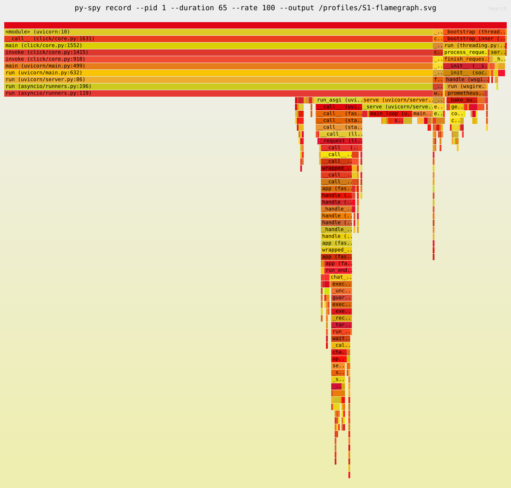

# Step 12b load-test report

**Date:** 2026-09-30. **Status:** partial campaign; overhead target missed;
S2/S4/S7 blocked by the missing passing S1 baseline.
No production performance optimization, real-provider call or paid inference is part
of this work. Unmeasured results are not passes.

## Environment

| Item | Observed configuration |
|---|---|
| Host | Apple M2 Pro, 12 cores, 16 GiB RAM; arm64 |
| OS | macOS 26.5.2, build 25F84 |
| Docker Desktop | 4.91.0; Engine 29.8.0; Compose 5.5.1 |
| Effective Docker VM resources | 12 vCPUs; 8,319,238,144 usable memory bytes (about 7.748 GiB) |
| Gateway runtime | Python 3.13.15; uvicorn 0.54.0; uvloop 0.22.1; httptools 0.8.0; one worker/container |
| Host tooling | Python 3.13.13 |
| Images | `grafana/k6:1.3.0`, `nginx:1.28.0-alpine`, `postgres:17.6`, `redis:7.4.5`, `prom/prometheus:v3.2.1` |
| App source | `main` commit `5fed6ec464d9254ad3bf354ab5331fe2e144688c`; no `src/` changes |
| Corrected benchmark runner | `ae2596750e19e5e94d51652401db07c7d93f67a2`; subsequent reporting/coverage hardening recorded in branch history |
| Gateway image ID | `sha256:76ddc65a913d6d1c158251b2807e87fa4703c4d5033ab42a386bfb78730fa1e3` (arm64) |
| App source SHA-256 | `6783cbb3d371d60992ed20efcac7dc34df6401f4fe0a318698e411ebf0be969c` |
| Catalogue SHA-256 | `6934266d0f385f53886cafd0de01be8d984f36bb0af8c099ff7975ab1c9b833a` |
| Lockfile SHA-256 | `590f6f3b785798c38fb09f5f4586f8da8886ef305cf2d5862d0e6631ea150c70` |

The Dockerfile's Python/uv base tags are not immutable digests; the image ID and
observed runtime above identify this local build. This is laptop evidence, including
Docker Desktop virtualization and shared-host scheduling, not production capacity.

## Method

The fake provider waits 200 ms and returns synthetic canonical responses with known
usage. Streaming emits 20 content chunks at 50 ms intervals, then a finish chunk,
usage and DONE. Embeddings have eight fixed synthetic dimensions by default. It never
echoes prompts or forwards traffic. A direct fake-provider baseline runs first.

The replicas and provider have only an internal Docker network; nginx exposes loopback
diagnostics and balances S3/S6/S7. One-replica k6 traffic bypasses nginx. CLI-issued
keys, the generated pepper and cache key are private ignored files, not report inputs.
The owner's `.env` is never used by the benchmark. A separate `gateway_loadtest`
database, Redis DB 14 and a fresh organization/team per run prevent contamination by
previous policies, caches, counters or receipts. No database/Redis reset is used.

- Three repetitions per scenario. S1/S3 use the same open-loop plateaus of 1, 5, 10,
  20, 40, 80, 160, 320, 640 and 1280 arrivals/s, 60 seconds each, stopping at the first
  overhead p99 >=10 ms, unexpected errors >0.1%, or generator insufficiency.
- Report one complete median run: S1/S3 by highest passing plateau (ties choose the
  middle repetition); others by client p99. All repetitions, including failed
  plateaus, remain in ignored local raw artifacts.
- S2/S4/S7 require floor(70% of S1's passing capacity). No positive passing capacity
  means BLOCKED, not a made-up workload. S5 independently uses 5 arrivals/s. S6 uses
  RPM=600 and 50 arrivals/s across two replicas for 180 seconds per repetition.
- Prometheus scrapes every second. Sum histogram bucket deltas over the selected
  replicas **before** interpolating p50/p95/p99. Keep those deltas and validate their
  count against k6 requests. Bucket estimates are not exact request percentiles.
- Client percentiles are k6's full HTTP duration, including streaming completion.
  `first_byte_latency` uses k6 waiting time (first response byte/headers), not an exact
  first-SSE-body measurement. Gateway streaming overhead uses the existing metric's
  first nonempty body boundary.
- Docker CPU/memory are sampled with a five-second wait between `stats` calls; actual
  spacing includes command latency. CPU 100% represents one vCPU. Memory is Docker's
  container working-set-style reading, not a Python heap measurement. Queue depth is
  sampled every two seconds and can miss short spikes.
- Wait for final scrape/writer flushing, then compare fresh-team durable receipts
  with successful client calls and completed synthetic provider calls. Empty queues
  alone do not prove complete accounting.

### Metric limitations worth knowing

Nonstreaming overhead includes request finalization after response delivery. The
instrumented provider operation also includes adapter work inside the awaited call
(`resilience/attempt.py`, `observability/attempt.py`), not just pure network waiting.
Therefore subtracting independently measured client/provider p99s would be wrong.
Baseline requests still perform small guardrail scans; the existing metric does not
subtract guardrail time. The guarded/excluded comparison in S4 must be separately
measured, and has not been silently approximated.

At 1 request/s a 60-second plateau has only about 60 requests. Key-cache refreshes
(default TTL 30 s) can dominate that tail. Failing this initial stage does **not**
prove every higher rate would fail: it stops this predeclared campaign and leaves
maximum capacity unestablished. No thresholds, cache TTLs or rates were changed to
make a result pass.

## Corrected campaign results

Values below come from the corrected campaign, not the pilot. All latencies are ms;
throughput is successful responses/s. Expected S6 429s are separate from errors.

| Scenario | Offered/s; replicas | Overhead p50 / p95 / p99 | Client p50 / p95 / p99 | Successes; throughput/s | Unexpected errors | Verdict |
|---|---|---|---|---|---|---|
| Fake provider | 5; direct | n/a | 202.99 / 208.14 / 209.50 | 300; 5.00 | 0% | Baseline measured; not saturated |
| S1 chat | 1; one | 11.17 / 24.04 / **34.75** | 216.83 / 225.17 / 261.72 | 61; 1.013 | 0% | **FAIL** overhead; maximum capacity not established |
| S2 streaming | prescribed 70% unavailable | Not measured | Not measured | Not measured | Not measured | **BLOCKED** |
| S3 two replicas | 1; two | 7.45 / 17.37 / **23.48** | 213.97 / 218.36 / 220.60 | 61; 1.013 | 0% | **FAIL** overhead; scaling factor undefined |
| S4 PII/guardrails | prescribed 70% unavailable | Not measured | Not measured | Not measured | Not measured | **BLOCKED** |
| S5 embedding cache | 5; one | 3.66 / 7.86 / **9.57** | 5.22 / 7.41 / 9.56 | 300; 5.00 | 0% | **PASS** observed cache behavior; 99.67% hits |
| S6 RPM=600 | 50; two | 2.34 / 7.09 / **9.55** | 3.36 / 208.89 / 212.44 | 1,820; 10.101 | 0% | Fixed buckets **PASS**; exact rolling-minute claim **FAIL** |
| S7 ten-minute soak | prescribed 70% unavailable | Not measured | Not measured | Not measured | Not measured | **BLOCKED**; no soak/memory-trend conclusion |

S1/S3 report repetition 2 because all three capacities tied at “no passing stage”.
This is **not** the median p99 across repetitions: it is the declared median complete
run by capacity. Fake provider and S5 select repetition 3; S6 selects repetition 2 by
client p99. Selected artifact directories are respectively
`provider-3-5-bbc532c2`, `S1-2-1-42faa11c`, `S3-2-1-6fc07592`,
`S5-3-5-93931ae9`, and `S6-2-50-b1283987`.

### Repetition evidence

| Scenario | Repetition 1 overhead p99 | Repetition 2 | Repetition 3 |
|---|---:|---:|---:|
| S1 | 24.584 | 34.750 | 24.250 |
| S3 | 23.856 | 23.475 | 24.168 |
| S5 | 9.736 | 9.570 | 9.571 |
| S6 | 9.742 | 9.548 | 9.614 |

No corrected run had dropped k6 iterations, unexpected errors, Redis errors or usage
queue drops/losses. Prometheus histogram counts matched k6 request counts for the
selected runs: S1 61/61, S3 61/61, S5 300/300, S6 9001/9001. The sampled queue maximum
was zero; this does not mean the queue was never briefly nonempty.

S6's overhead/client distributions include its many expected fast 429 responses.
They are not a provider-bound-chat-only population, and cannot turn S1 into a pass.

The selected fake-provider run's CPU averaged 1.17% of one vCPU (sampled peak 1.39%),
using 38.56–39.54 MiB. At 5/s it demonstrates headroom relative to the tested 1/s S1
stage, **not** the fake server's maximum throughput.

### Accounting and S6 exactness

- S1: 61 client successes = 61 completed provider calls = 61 durable receipts.
- S3: 61 = 61 = 61.
- S5: 300 client successes = 1 provider receipt + 299 cache-hit receipts. One provider
  call completed; the remaining responses did not call the provider.
- S6 median: 9,001 requests = 1,820 successes + 7,181 expected 429s; 1,820 completed
  provider calls = 1,820 durable successful receipts. There were no error receipts.
- S6 full fixed UTC-minute buckets reached exactly 600, with no fixed bucket above
  600 in any repetition. Partial edge buckets are not required to reach 600.
- Exact rolling 60-second maxima from receipt start times were **968, 624 and 821**
  across the three repetitions. Thus the strict rolling no-over-admission claim is
  not met. The median's fixed buckets were 24, 600, 600, 596; its rolling maximum was
  624. Approximate sliding-window weighting explains this: a burst can be discounted
  by the fixed bucket's age before every individual request is 60 seconds old.

These timestamps are request-start times, not atomically recorded Redis admission
times. They reveal substantial rolling-window over-admission, not a formal proof at
single-request boundary precision. No limit policy was changed to hide the finding.

### Container resources (selected runs)

CPU is mean / sampled peak (% of one vCPU); memory is sampled maximum MiB.

| Container | Provider CPU; memory | S1 CPU; memory | S3 CPU; memory | S5 CPU; memory | S6 CPU; memory |
|---|---|---|---|---|---|
| Gateway 1 | 0.83 / 1.42; 86.11 | 2.53 / 3.42; 87.25 | 1.53 / 2.03; 87.98 | 2.97 / 3.45; 89.20 | 8.18 / 11.54; 90.44 |
| Gateway 2 | 1.02 / 2.25; 82.57 | 1.03 / 1.69; 82.21 (idle) | 1.44 / 2.39; 83.02 | 0.65 / 0.77; 82.77 (idle) | 8.13 / 11.40; 84.27 |
| Fake provider | 1.17 / 1.39; 39.54 | 0.50 / 0.84; 38.46 | 0.37 / 0.48; 38.29 | 0.16 / 0.22; 37.81 | 0.71 / 1.84; 38.76 |
| nginx | 0 / 0; 4.14 | 0 / 0; 4.63 | 0.06 / 0.08; 5.89 | 0 / 0; 4.65 | 1.13 / 1.58; 6.32 |
| Postgres | 1.53 / 4.96; 49.20 | 3.20 / 4.94; 46.59 | 1.70 / 3.89; 46.56 | 1.47 / 4.38; 47.11 | 2.43 / 6.14; 48.71 |
| Redis | 1.46 / 2.61; 11.22 | 1.54 / 2.79; 11.34 | 1.73 / 2.83; 11.58 | 1.38 / 2.68; 11.83 | 2.60 / 4.07; 11.55 |
| Prometheus | 0.69 / 0.89; 150.90 | 0.79 / 1.20; 155.60 | 0.75 / 0.96; 153.10 | 0.65 / 0.90; 153.90 | 0.52 / 0.75; 152.70 |
| k6 | 2.21 / 3.03; 20.78 | 1.19 / 1.51; 20.19 | 0.95 / 1.19; 20.88 | 1.74 / 2.89; 22.61 | 4.94 / 7.68; 28.84 |

There were nine samples per container for these 60-second runs and 26 for S6.
The three-minute S6 observation is **not a substitute** for S7's ten-minute soak.
CPU usage is low; these data do not establish CPU saturation as the latency cause.
Sparse key-cache refreshes and multiple Redis waits are hypotheses needing a timed
breakdown, not proven causes from this table alone.

### SLO verdicts

- **Overhead <10 ms p99:** **FAIL** in tested uncached chat S1/S3. No positive
  SLO-compliant baseline was established, and no scaling factor can be calculated.
  Cache-hit S5 passes this observed metric; that is not a pass for uncached chat.
- **Availability 99.9%, excluding provider errors:** observed **100%** valid responses
  after excluding expected S6 admission 429s, with zero fake-provider errors. This
  passes the sampled error-rate criterion, not a statistically certified production
  availability SLA.
- **Exact limits:** fixed buckets reach 600 without excess; strict rolling 60-second
  enforcement **FAILS** the specification's stronger reading.
- **Soak/accounting/memory trend:** short-run receipt equality and zero drops are
  measured; ten-minute sustained stability and memory trend remain **INCONCLUSIVE**.

## Pilot failures and corrections (retained, not hidden)

1. Initial `docker compose up -d` failed with a missing
   `/Users/udo/.docker/run/docker.sock`. `open -a Docker` started Docker Desktop;
   repeating the required compose command started Postgres and Redis successfully.
2. The first loadtest compose startup could not reach readiness over host ports on the internal
   network. Loopback-only nginx diagnostic listeners fixed host access; measured
   single-replica traffic still targets the replica directly from k6.
3. A three-repetition smoke command had a 120-second harness timeout: two completed
   repetitions reported zero errors and p99 overhead 23.269/24.419 ms. It timed out
   before completing the third. This is an incomplete pilot, not a three-run pass.
4. `docker compose ... stats --no-stream --format '{{json .}}' fake-provider
   gateway-loadtest-1 gateway-loadtest-2 loadtest-nginx prometheus` failed exactly with
   `accepts at most 1 arg(s), received 5` (exit 1) on Compose 5.5.1. The corrected
   sampler requests all services without positional arguments; a regression test
   checks that command shape. The pilot's resource fields explicitly say unavailable.
5. Pilot S1's three 1/s stages reported overhead p99 23.200, 24.296 and 24.182 ms,
   zero errors, and 60 successful provider calls/receipts per run. Its CPU/memory
   coverage was invalid. The pilot S3 command was interrupted after two completed
   stages to avoid spending further time on invalid instrumentation; that batch did
   not run S6. The corrected campaign repeats the independent scenarios once, three
   repetitions each, for missing instrumentation—not to seek a passing SLO.

Raw pilot directories and summaries remain locally under ignored `loadtest/results/`.
The primary completed campaign and history copies preserve their selected artifact IDs.

## Profiling

`uvx py-spy --version` initially failed on the host with `zsh:1: command not found:
uvx` (exit 127). `uv tool run py-spy --version` succeeded with py-spy 0.4.2.
`uv run python -m loadtest.profile` succeeded. It builds a separate py-spy 0.4.2 image,
then runs `uvx --offline py-spy record --pid 1 --duration 65 --rate 100 --output
/profiles/S1-flamegraph.svg` with the fake-key replica's PID namespace, `SYS_PTRACE`,
`seccomp=unconfined` and no network. Those permissions are not production defaults.
An extra S1-shaped 1/s diagnostic run returned zero errors and overhead p99 24.4 ms;
it is **not** substituted into the three capacity repetitions.

The [flame graph](S1-flamegraph.svg) contains **292 samples**. The top three exclusive
sample frames (subtracting children rather than ranking wide parent stacks) are:

| Sampled frame | Exclusive samples | Fraction of all samples |
|---|---:|---:|
| `run (asyncio/runners.py:119)` | 169 | 57.88% |
| `main_loop (uvicorn/server.py:248)` | 7 | 2.40% |
| `sleep (asyncio/tasks.py:718)` | 6 | 2.05% |

These are **scheduler/native-loop frames**, not demonstrated pure-Python CPU
optimization hotspots. The profile is sparse (1 request/s), does not include native
stack unwinding, and cannot attribute time below the C-level uvloop call. Naming
`Runner.run` does not prove asyncio consumes most CPU or causes the p99 overhead.
The profile provides no evidence justifying a Rust extension or faster JSON library.
The profiler's default SVG is top-down (an icicle orientation); the analysis script
handles either orientation and has a regression test against ranking entry points.

## Verification and housekeeping

The budget-rebuild test now warms Redis, uses a 0.5-second rebuild deadline, asserts
that the blocked spend query was entered and cancelled, and retains a generous
10-second safety timeout. It passed **20 consecutive pytest invocations**, each with
both fail-mode cases: 40/40 cases passed. The lock-wait test uses the same comfortable
deadline and verifies ownership preservation. Cache timeout, full usage queue and
guardrail offloading tests assert cancellation/ordering; scanner tests keep only
generous safety limits. Short configured shutdown deadlines test behavior after an
explicit event and are not tight wall-clock assertions.

The first combined integration suite also exposed a pre-existing cache-purge test
counting every tenant's audit entries in the shared session database. The isolated
assertion now selects its own team's target ID; the subsequent full integration run
passed 1090 tests. Final post-change gates and separate db/Redis outputs are recorded
below. All tests mock provider I/O; no real inference was performed.

| Command | Final output |
|---|---|
| `uv run ruff check .` | `All checks passed!` |
| `uv run ruff format --check .` | `329 files already formatted` |
| `uv run pyright` | `0 errors, 0 warnings, 0 informations` |
| `uv run pytest -q` | `997 passed, 142 skipped, 25 deselected in 18.66s` |
| `GATEWAY_TEST_DATABASE_URL=… uv run pytest -q -m db` | `90 passed, 10 skipped, 1064 deselected in 29.86s` |
| `GATEWAY_TEST_DATABASE_URL=… GATEWAY_TEST_REDIS_URL=redis://127.0.0.1:6379/15 uv run pytest -q -m redis` | `52 passed, 1112 deselected in 14.10s` |
| 20× fixed deadline test with `GATEWAY_TEST_REDIS_URL=redis://127.0.0.1:6379/15` | Every invocation: `2 passed`; 40/40 parameter cases |

The database URL was the repository's local-only compose account at
`127.0.0.1:5432/gateway`, not a production credential. Normal pytest's 142 skips are
opt-in infrastructure tests without service URLs; db-only's 10 skips require Redis too.
An attempted parallel db/Redis verification was **not independent**: migration 0009
alters the cluster-wide `gateway_readonly` role. The db fixture failed with
`tuple concurrently updated` at `ALTER ROLE gateway_readonly NOLOGIN` (100 setup
errors); Redis passed. The final db command above ran alone and passed. This agent's
orchestration mistake and the serial-run rule are recorded rather than changing
product code to mask it. `git diff main -- src uv.lock` is empty. `.env` is untracked.
Docker Desktop/services remained running.

## Open choices, objections and limitations

- Starting rate/plateau duration: 1 request/s, 60 seconds; geometric doubling after
  5/s gives reproducible coarse bounds, not a precise maximum.
- S5 rate: 5/s; S6 overload rate: 50/s; smoke: one 30-second 5/s run in CI with zero
  errors, no missed iterations, complete histogram coverage and p99 <50 ms.
- Embedding payload: eight synthetic dimensions, not a production model's real vector
  size. Larger real vectors can add serialization/encryption cost; the cache latency
  is specific to this controlled payload.
- Median selection, warmup and reporting arithmetic are explicit above. A missing
  sample is unavailable, never zero.
- Binding S6 “exactly 600 per window” conflicts with the accepted implementation's
  **weighted sliding-window estimate**, not a log of every admission in the last
  60 seconds. `window.lua` checks `used < limit` before incrementing; the estimate
  can cross the fractional boundary by less than one. Fixed UTC-minute counts and
  exact rolling counts are reported separately using receipt start timestamps, which
  are not atomic Redis admission timestamps. No limiter policy was rewritten.
- Laptop virtualization, a fake provider and short sparse samples constrain these
  conclusions. Real providers add network variance; neither these observations nor
  zero errors certify a production SLA.
- A 5 KB PII workload does not cover ADR 0020's separate large numeric scans,
  mixed-request scheduling and worker saturation recommendations. Those remain
  unverified workloads, not implied successes.
- Kubernetes file-secret directory permissions remain explicitly **unverified** in
  [deployment.md](../deployment.md). No real cluster or remote CI execution is claimed.

## Recommendations

Ranked performance follow-ups, **hypotheses rather than demonstrated speedups**:

1. **Highest expected impact: isolate I/O and platform latency.** Re-run a separately
   declared campaign on target Linux hardware and time authentication misses, each
   Redis admission/finalization hop and serialization separately. Multiple Redis
   round trips and cache refreshes are plausible contributors; low sampled CPU and
   the scheduler-heavy profile do not prove which. If confirmed, reduce redundant
   round trips while preserving atomicity and cache/admission ordering. Do not
   silently extend revocation TTLs or relax the SLO.
2. **Next: characterize real capacity before adding workers.** Use a reviewed longer
   or higher-starting-load campaign and native-stack profiling to separate sparse
   tails from sustained bottlenecks. Compare replicas with shared Redis/Postgres
   pressure. More workers/container would require deliberate multiprocess metrics
   support; adding them blindly violates the current per-process registry model.
   uvloop and httptools are **already installed and active**, not missing optimizations.
3. **Conditional CPU work only after evidence.** Benchmark serialization/guardrail
   time explicitly before considering a faster JSON library. Run ADR 0020's large
   numeric scans and worker-saturation cases before considering a Rust scanner
   extension. This profile supplies no justification for either dependency/change.

Separately, resolve the **correctness contract** exposed by S6: either visibly document
the accepted approximate weighted window or implement a reviewed exact rolling policy
with independent tests. That is not a tiny performance tweak and was not changed here.
No production optimization was made; future changes need their own before/after
campaign and policy review.

## Requirements not completed or not verified

- S2, S4 and S7 were not run: no positive SLO-compliant S1 baseline exists in this
  stopping-rule campaign, so “70% of max” is undefined. Their implementation and
  commands are present; charts/numbers are not invented for them. Consequently the
  roadmap is marked partial rather than claiming all steps complete.
- Maximum sustainable throughput, the two-replica scaling factor, guardrail-only
  cost, stream stability at the prescribed load, and ten-minute memory/accounting
  stability remain unverified. The 10 ms uncached-chat target was not met.
- S6's fixed buckets pass; the stronger rolling-window exactness claim is not met.
- The GitHub Actions smoke job was added and its exact local command passed:
  30 seconds, 5/s, zero errors/missed iterations, complete metric coverage,
  overhead p99 **23.970 ms <50 ms**. Remote GitHub CI was not run: no push was made.
- `uvx` was absent on the host, but Docker's `uvx` profiling worked; no profiling
  requirement is claimed blocked. Charts were regenerated successfully after fixing
  handling of BLOCKED scenarios and zero-count bins. Matplotlib is ephemeral only.
- Kubernetes file-secret mounts were not tested in a cluster.

New Python modules are under 300 lines. The pre-existing API usage test module remains
412 lines to preserve unrelated legacy tests; this task only changes its timing
assertions. There is no production `src/` diff or lockfile/dependency change.

## Reproduce

See [loadtest/README.md](../../loadtest/README.md) for one command per scenario, raw
artifacts, charts and stack-only profiling. No keys are present in the report.
