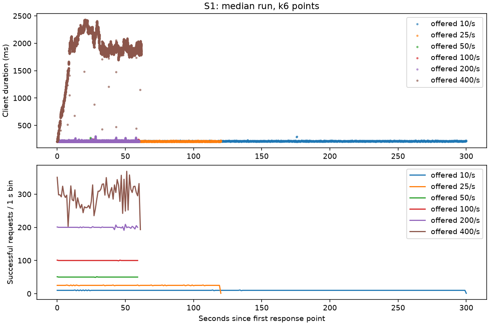
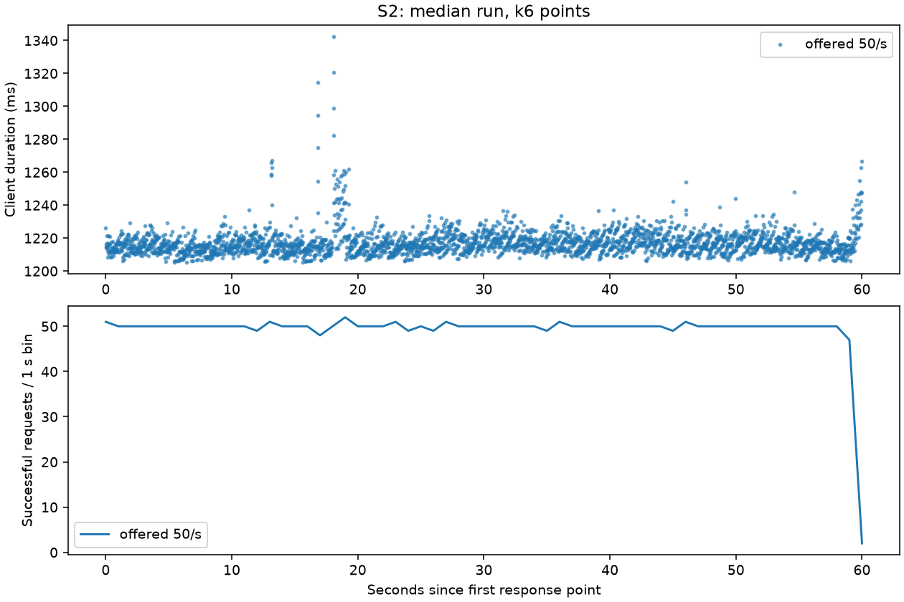
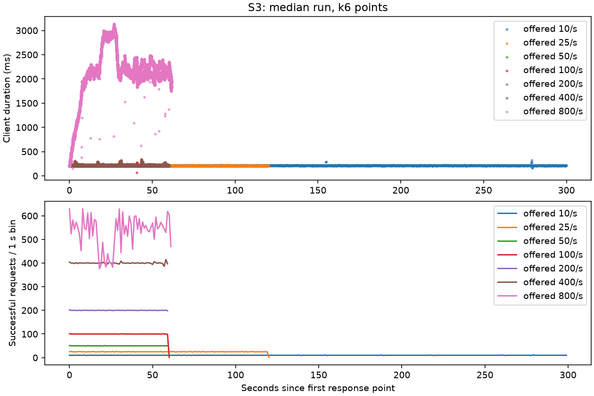
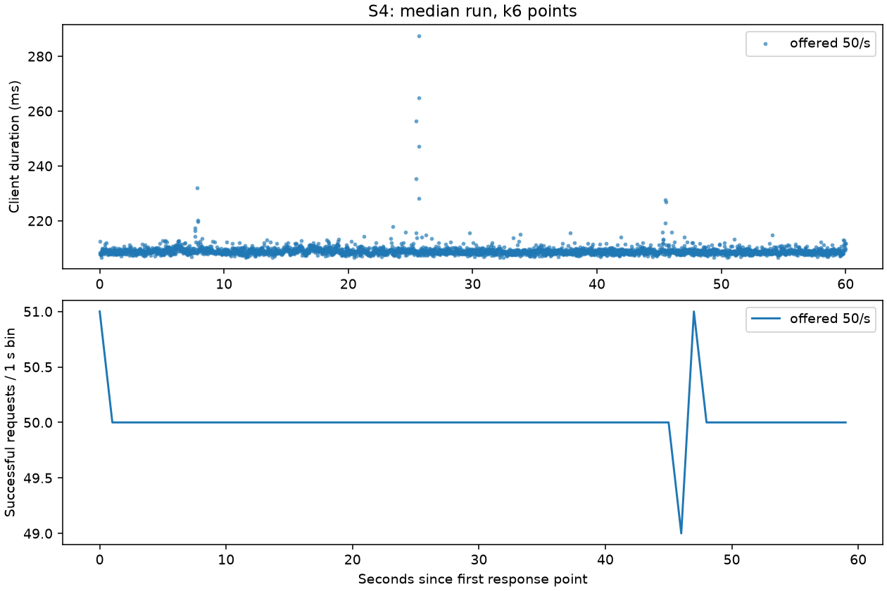
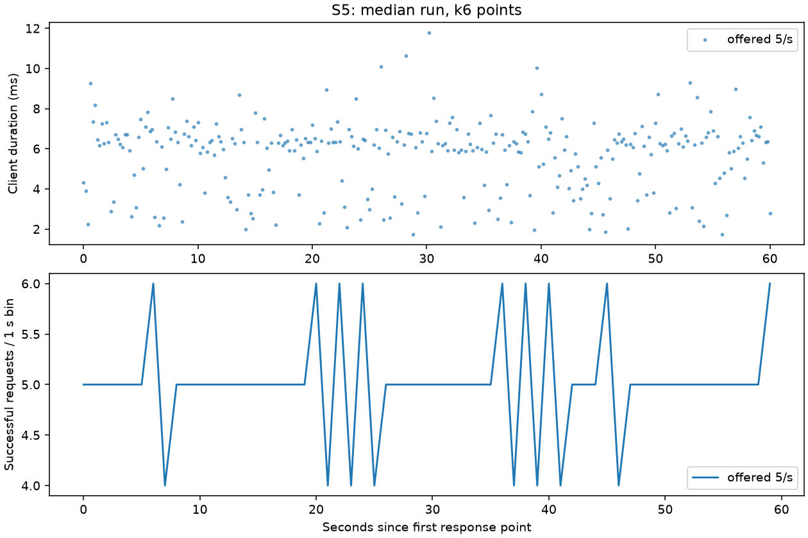
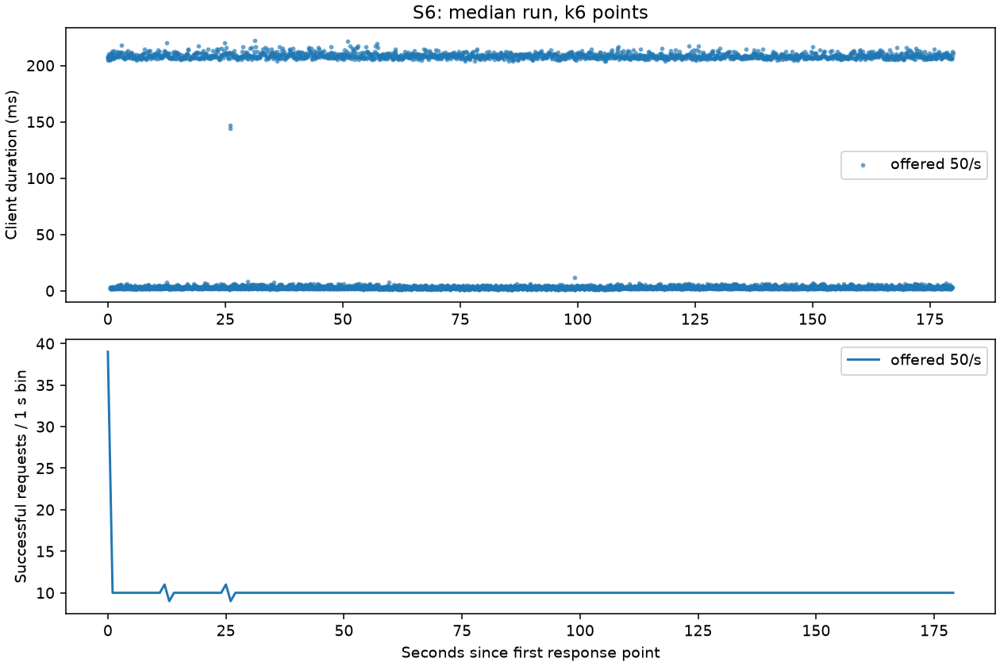
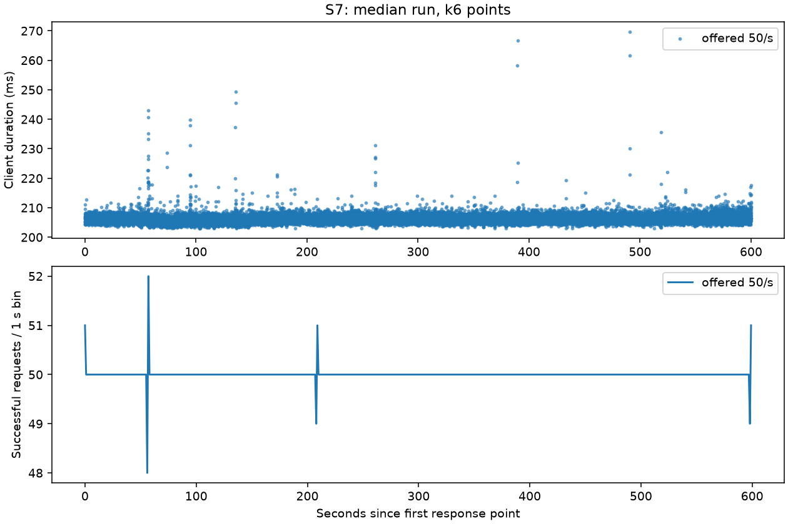

# Step 12b: amended load-test campaign

**Date:** 2026-09-30. **Status:** full amended campaign completed against the fake
provider. Targets are evaluated from measurements below; completion is not a claim
that every target passed. No real provider was called and no performance optimization
was introduced.

## Environment

| Item | Observed configuration |
|---|---|
| Host | Apple M2 Pro, 12 cores, 16 GiB RAM; arm64 |
| OS | macOS 26.5.2, build 25F84 |
| Docker | Engine 29.8.0; Compose 5.5.1 |
| Docker VM | 12 vCPUs; 8,319,238,144 usable bytes (about 7.748 GiB) |
| Container runtime | Python 3.13.15; uvicorn 0.54.0; uvloop 0.22.1; httptools 0.8.0; one worker/replica |
| Images | k6 1.3.0; nginx 1.28.0-alpine; Postgres 17.6; Redis 7.4.5; Prometheus 3.2.1 |
| Gateway image ID | sha256:d81c92b6f1696c8d717075036243f21b1166200ccc9bd88b92a9a73327ba1c94 |
| Campaign source commit | `2cb7ee35fb451a2fcad51513ca91325a03ac957d` |
| Python + Lua source SHA-256 | `b667827a1c4ee616e98475b8208a276de86f6a8a2f68807d43cdbbef492921c3` |
| Catalogue SHA-256 | `6934266d0f385f53886cafd0de01be8d984f36bb0af8c099ff7975ab1c9b833a` |
| Lockfile SHA-256 | `590f6f3b785798c38fb09f5f4586f8da8886ef305cf2d5862d0e6631ea150c70` |

## Method and definitions

The fake server waits 200 ms and returns known synthetic usage. Streaming emits
20 content chunks at 50 ms intervals, followed by finish, usage and DONE. The
replicas and provider use an internal network and explicit fake-provider URLs.
The runner ignores the owner's .env and inherited gateway configuration. Generated
keys are private ignored files. Every run gets a fresh team, a separate benchmark
database and Redis DB 14; no existing database or Redis state is reset.

Each run has 30 seconds of warmup at its declared offered rate, excluded by a
distinct request-ID prefix. S1/S3 stages are 10, 25, 50, 100, 200, 400 and 800/s,
lasting max(60 s, 3000 / rate). A stage continues past an overhead miss. Ramps stop
at >1% unexpected errors, client p99 >5 times the direct-provider baseline, or
incomplete telemetry. Dropped iterations are recorded and do not alone stop the ramp. The stopping stage is retained. Every measured
stage has at least 3000 requests unless generation is explicitly incomplete.

**SLO capacity** is the highest tested offered stage with exact overhead p99 <10 ms
and errors <0.1%. **Saturation throughput**, per the amendment's error criterion,
is successful responses/s at the highest tested stage with errors <0.1%. A stage
that triggers the client-latency stopping rule can still qualify under that error
criterion. If the ceiling is reached, capacity beyond 800/s is unmeasured.
Scaling is two-replica saturation throughput / one-replica saturation throughput.
The literal error-only definition can include a stage whose generator dropped
iterations. Delivered-workload saturation is therefore also reported: the highest
error-eligible stage with zero dropped iterations. A dropped iteration never made
an HTTP request and is not part of the HTTP error rate. Neither a low HTTP error
rate nor the nominal offered rate proves that all scheduled traffic was served.
These are discrete tested stages, not interpolated production capacity claims.

S1/S3/S6 run three times. Median ramps are selected by saturation throughput;
ties select the middle repetition. S6 and S5 select a whole median run by client
p99. S2/S4/idle/S7 run once; S5 retains the original spec's three-repetition requirement. S2/S4/S7 use
half of S1's selected SLO capacity, or 50/s when no capacity was established.
The provider baseline is one measured run. All raw repetitions and warmups remain
in ignored loadtest/results, with historical summaries preserved.

Exact overhead percentiles use unrounded overhead_ms from access lines, with
linear interpolation between sorted observations. The histogram observes the
same timing once, through a callback before access logging, while its trace is
active. Access-log serialization is after this timing boundary. Nonstreaming
overhead includes finalization and subtracts awaited provider operations; streaming
overhead stops at the first nonempty body byte and subtracts provider waits up to
that point. Provider operations include adapter work, not just network waiting.
Subtracting independent client/provider percentiles would be invalid. Finalization
can run after response bytes reach the client, so at saturation this gateway timing
can exceed client HTTP duration; they measure different boundaries.

Prometheus estimates aggregate bucket deltas across the selected replicas before
interpolation. Both log and histogram counts must match k6 requests for measurement
coverage. Client p99 is full HTTP duration, including stream completion. k6 first
byte latency is waiting time to response headers, not an exact first-SSE-body time.
Expected S6 429s are separated from unexpected errors; its latency population
contains those fast rejections. Ordinary requests still run guardrail scans, and
S4 overhead includes its 5 KB input scan/redaction. An overhead distribution
excluding guardrail execution was not separately instrumented or inferred.

No new project dependency is installed: matplotlib is used through uv only for
chart generation, and py-spy is an isolated diagnostic image.

CPU/memory are sampled about every five seconds; command latency affects spacing.
CPU 100% means one vCPU. Memory is Docker's container working-set-style value,
not Python heap size. Queue samples every two seconds can miss short spikes.
Receipt counts are compared after flushing, rather than assuming an empty queue
proves lossless accounting. Laptop Docker Desktop results include virtualization
and shared-host scheduling. Real providers add unmeasured network variation.

Direct fake-provider baseline: client p50/p95/p99 **202.601 / 204.475 / 205.532 ms**, **5.000 successes/s**, errors **0.000%**. The ramp client-p99 stop boundary is **1027.658 ms**.

An additional direct-provider control used 800/s, 30-second warmup and 60 measured seconds: client p50/p95/p99 **200.433 / 201.335 / 202.495 ms**, **797.348 successes/s**, **0.000% errors**, **0 dropped iterations**. This diagnoses upstream/generator headroom; it does not replace the original ramp baseline or its stop boundary.

The original runner stopped S3 repetition 3 after one dropped iteration at 200/s (client p99 220.514 ms, HTTP errors 0.025%). Neither amendment stopping threshold was crossed. After correcting that rule, the missing higher stages were measured with the same application source hash. Earlier stages were retained; no percentile was replaced. The runner now continues despite dropped iterations.

## S1: one replica, selected median ramp

| Offered/s | Measured s; requests | Exact overhead p50 / p95 / p99 ms | Client p99 ms | Successes/s | Errors; rate | Dropped iterations | Histogram p99 ms | Gateway CPU mean / peak %; max MiB |
|---|---|---|---|---|---|---|---|---|
| 10 | 300; 3001 | 7.549 / 12.441 / 15.181 | 223.351 | 9.995 | 0; 0.000% | 0 | 15.971 | 1: 9.5 / 12.0; 132.1 |
| 25 | 120; 3001 | 5.155 / 9.817 / 12.571 | 220.423 | 24.962 | 0; 0.000% | 0 | 12.737 | 1: 16.6 / 19.0; 132.8 |
| 50 | 60; 3001 | 3.682 / 5.591 / 7.161 | 210.798 | 49.844 | 0; 0.000% | 0 | 7.462 | 1: 22.9 / 24.8; 132.5 |
| 100 | 60; 6001 | 2.509 / 3.687 / 7.199 | 212.294 | 99.672 | 0; 0.000% | 0 | 7.302 | 1: 37.5 / 38.2; 134.0 |
| 200 | 60; 12001 | 2.335 / 11.886 / 24.435 | 232.925 | 199.332 | 0; 0.000% | 0 | 24.634 | 1: 61.3 / 63.6; 136.4 |
| 400 | 60; 18309 | 2803.052 / 3468.516 / 3612.089 | 2386.988 | 295.978 | 20; 0.109% | 5692 | 4970.502 | 1: 100.0 / 100.7; 140.3 |

SLO capacity: **100 offered requests/s**. Saturation throughput: **199.332 successful responses/s** at **200/s**.
Full generation at that stage: **True**. The highest eligible stage with all iterations generated was **200/s**, with **199.332 successes/s**.
The final listed stage triggered a stopping criterion.

## S3: two replicas, selected median ramp

| Offered/s | Measured s; requests | Exact overhead p50 / p95 / p99 ms | Client p99 ms | Successes/s | Errors; rate | Dropped iterations | Histogram p99 ms | Gateway CPU mean / peak %; max MiB |
|---|---|---|---|---|---|---|---|---|
| 10 | 300; 3001 | 7.603 / 11.545 / 13.590 | 220.688 | 9.998 | 0; 0.000% | 0 | 14.182 | 1: 5.2 / 6.5; 135.6; 2: 5.4 / 12.4; 137.4 |
| 25 | 120; 3001 | 4.941 / 6.993 / 7.979 | 212.702 | 24.964 | 0; 0.000% | 0 | 8.849 | 1: 8.9 / 10.4; 135.6; 2: 9.0 / 10.0; 137.0 |
| 50 | 60; 3001 | 3.556 / 5.063 / 6.524 | 208.920 | 49.844 | 0; 0.000% | 0 | 7.296 | 1: 12.2 / 13.4; 135.8; 2: 12.1 / 13.5; 137.0 |
| 100 | 60; 6001 | 2.762 / 4.172 / 7.310 | 209.440 | 99.652 | 1; 0.017% | 0 | 7.356 | 1: 18.8 / 19.5; 136.4; 2: 18.4 / 18.8; 136.9 |
| 200 | 60; 12000 | 2.176 / 2.950 / 5.590 | 208.025 | 199.330 | 0; 0.000% | 0 | 6.208 | 1: 32.1 / 34.9; 138.3; 2: 30.7 / 34.1; 138.8 |
| 400 | 60; 24001 | 2.755 / 14.286 / 31.620 | 239.233 | 398.661 | 0; 0.000% | 0 | 35.959 | 1: 69.0 / 73.5; 140.5; 2: 69.3 / 75.8; 140.7 |
| 800 | 60; 33016 | 3187.029 / 4424.344 / 4670.245 | 2988.563 | 532.693 | 27; 0.082% | 14985 | 4971.100 | 1: 99.9 / 100.4; 143.8; 2: 99.9 / 100.6; 143.7 |

SLO capacity: **200 offered requests/s**. Saturation throughput: **532.693 successful responses/s** at **800/s**.
Full generation at that stage: **False**. The highest eligible stage with all iterations generated was **400/s**, with **398.661 successes/s**.
The final offered ceiling was reached; higher throughput is unmeasured.

S3 scaling factor under the amendment's error-only definition: **2.672×**. Using only fully generated stages: **2.000×**. Different stage eligibility and dropped iterations limit the interpretation of the first ratio.

## Other scenarios

| Scenario | Offered/s; measured s | Exact overhead p50 / p95 / p99 ms | Client p99 ms | Successes/s | Errors | Histogram p99 ms | Verdict |
|---|---|---|---|---|---|---|---|
| S2 | 50; 60 | 1.803 / 4.390 / 9.364 | 1250.097 | 48.996 | 0.000% | 9.583 | Exact-overhead target met |
| S4 | 50; 60 | 7.493 / 9.144 / 11.370 | 213.713 | 49.842 | 0.000% | 11.982 | Exact-overhead target missed |
| S5 | 5; 60 | 4.609 / 6.231 / 7.425 | 10.040 | 5.016 | 0.000% | 7.500 | Exact-overhead target met |
| S6 | 50; 180 | 1.958 / 6.247 / 8.710 | 213.072 | 10.154 | 0.000% | 8.957 | Rolling bound PASS |
| S7 | 50; 600 | 3.878 / 5.659 / 7.242 | 209.874 | 49.985 | 0.000% | 7.452 | Exact-overhead target met |
| idle | 1; 300 | 7.545 / 10.083 / 12.940 | 218.068 | 1.003 | 0.000% | 13.325 | Informational; no SLO verdict |

S2: **50/s**, rule **50% of S1 SLO capacity**. k6 first-byte p99 **220.934 ms**; validation requires all 20 content chunks, usage and DONE.

S4: **50/s**, rule **50% of S1 SLO capacity**. The approximately 5 KB synthetic PII prompt uses email, phone and IP rules configured to redact; default card/IBAN rules also execute. The total exact overhead is measured; a separate guardrail-only time is unavailable.

S7: **50/s**, rule **50% of S1 SLO capacity**. **30001 client successes**, **30001 fake-provider completions**, **30001 durable successful receipts**; queue sampled maximum **1.0**.

The initial S2 attempt (`S2-1-50-5c1c3094`) had an invalid compact-JSON regex validator: it reported every request as an error although access logs recorded 3000 HTTP 200 responses and 1 HTTP 503 responses. Gateway SSE uses legal whitespace after JSON colons. The 503 remains a real failure in the retained attempt. A structural JSON validator replaced the regex; 12 pure k6 regression checks passed before the one corrected S2 run. Both attempts remain in history; the invalid verdict was not relabeled as success.

S7 accounting equality and zero writer-drop/loss counters: **PASS**. Unexpected errors: **0**; dropped iterations: **0**; exact/histogram count coverage: **True**. Redis error-counter delta: **2.0**. No HTTP-error-free result should be read as zero dependency errors. Memory trends are shown below and are limited observations, not a leak-free verdict.

S5 cache-hit ratio **100.000%**; 301 cache-hit receipts and 0 provider receipts for 301 successful responses. Warmup primes the response cache and is excluded.

## S6: exact rolling-minute bound

RPM=600, T=100 ms, default B=ceil(600 × 0.05)=30. Atomic Redis TIME
timestamps identify admitted requests across both replicas. The observation includes
warmup as well as the 180-second measured window. Every rolling interval is checked
with a two-pointer scan, using half-open windows (t-60, t]. The bound is **630**.
RPM-rejected requests do not supply an admission timestamp. The seeded property test
also covers random arrivals, sustained pressure and late-minute bursts.

| Repetition | Measured successes | Expected 429s | All observed admissions | Maximum rolling 60 s | Bound | Coverage / assertion |
|---|---|---|---|---|---|---|
| 1 | 1829 | 7172 | 2158 | 629 | 630 | True / True |
| 2 | 1829 | 7171 | 2158 | 629 | 630 | True / True |
| 3 | 1829 | 7171 | 2158 | 629 | 630 | True / True |

Before this campaign, replacing the RPM route temporarily with the old weighted
counter made the property test fail: **631 <= 600 + 30** was false (exit 1).
The old algorithm was reverted, and the complete GCRA Redis suite passed. The
initial uniform-arrival-only mutation did not fail; adding a late-minute burst
made the regression test discriminate the actual over-admission flaw.
The two-service race test uses RPM=10 and explicit B=10 to preserve its ten
simultaneous permits. The default burst for RPM=10 is one, so default behavior
does not promise the whole minute's quota immediately. Headers report available
burst slots and the wait for the next conforming slot. Lua reload, check-only
reads and Redis-down failure policies remain covered by tests.
Old and upgraded replicas do not share the old counter/new slot key. A mixed-version
rollout must drain old replicas and age their admissions out for a minute before
claiming this bound across the whole window; benchmark teams use only new replicas.

Redis fail-open behavior, outages and loss of state are outside this bound; the
campaign uses fail-closed. TPM remains an approximate post-response token counter.

## Idle path: 1 request/s for five measured minutes

This distribution is informational. With a 30-second verified-key TTL, cold lookups
are a much larger fraction of 300 samples than of a high-rate plateau. Hit/miss is
the verified-key cache, separate from the response cache.

| Verified-key cache | Requests | Exact overhead p50 / p95 / p99 ms |
|---|---|---|
| hit | 291 | 7.497 / 9.561 / 11.142 |
| miss | 10 | 11.607 / 14.536 / 15.113 |

## Histograms, repetitions and resource evidence

Histograms estimate where requests fall inside each bucket; logs preserve the actual
observations. Finer boundaries near 10 ms reduce, but do not eliminate, this difference.
Only exact observations decide the overhead verdict. Reported percentiles are rounded
for readability, not substituted with histogram estimates.

| Ramp | Repetition | SLO offered/s | Saturation offered/s | Saturation successes/s | Stages | Coverage |
|---|---|---|---|---|---|---|
| S1 | 1 | 100 | 200 | 199.330 | 10, 25, 50, 100, 200, 400 | True |
| S1 | 2 | 100 | 200 | 199.335 | 10, 25, 50, 100, 200, 400 | True |
| S1 | 3 | 100 | 200 | 199.332 | 10, 25, 50, 100, 200, 400 | True |
| S3 | 1 | 200 | 800 | 542.491 | 10, 25, 50, 100, 200, 400, 800 | True |
| S3 | 2 | 200 | 800 | 532.693 | 10, 25, 50, 100, 200, 400, 800 | True |
| S3 | 3 | 100 | 400 | 398.667 | 10, 25, 50, 100, 200, 400, 800 | True |

Selected S1 repetition: **3**; selected S3 repetition: **2**. The application source hash is identical across initial and corrected benchmark stages; tooling commits and the S3 continuation environment are retained separately.

Full per-stage resource summaries, exact/histogram distributions, accounting counts and artifact IDs are retained in [campaign-evidence.json](campaign-evidence.json).

| S7 gateway | CPU mean / peak % | Memory min / max MiB | Memory slope bytes/s after first 120 measured s | Samples |
|---|---|---|---|---|
| llm-gateway-gateway-loadtest-1-1 | 13.6 / 24.4 | 139.60 / 141.00 | 276.55 | 86 |
| llm-gateway-gateway-loadtest-2-1 | 13.3 / 18.9 | 135.80 / 137.60 | -493.04 | 86 |

## First campaign and why the method changed

The first campaign measured real results honestly, but its initial 1/s × 60 s stage
had about 60 samples, so p99 was dominated by one slow request. It stopped there,
leaving capacity unknown and S2/S4/S7 blocked. Selected histogram overhead p99 was
34.75 ms for one replica and 23.48 ms for two; the 10–25 ms bucket around the SLO
could not support a precise near-boundary verdict. These are historical estimates,
not comparable exact percentiles from the new campaign.

At RPM=600 the approximate weighted counter admitted rolling-minute maxima of
968, 624 and 821 across repetitions, measured from receipt request-start times.
Those timestamps were not atomic admission times, but the large overshoot exposed
the algorithm's inability to guarantee a rolling bound. GCRA now provides the
RPM + B bound; this is an authorized correctness change, not a performance tweak.
TPM was not separately load-tested, and the RPM overshoot is not a measured TPM
overshoot. First-campaign raw artifacts and git history remain available.

## Gates and verification

- Ruff: `All checks passed!`.
- Ruff format: `337 files already formatted`.
- Pyright: `0 errors, 0 warnings, 0 informations`.
- Normal tests: `1012 passed, 154 skipped, 25 deselected in 18.25s`.
- Database: `90 passed, 10 skipped, 1091 deselected in 28.06s`.
- Redis: `64 passed, 1127 deselected in 48.56s`.
- promtool: `SUCCESS: 5 rules found`.
- Mutation: old-counter assertion failed at 631 against 630; GCRA restored.
- The earlier deterministic budget deadline fix passed 20 repetitions in the first
  campaign; its current tests also pass the Redis suite.

Database and Redis suites ran sequentially with the exact AGENTS.md environment
commands. uv's cache was blocked in the sandbox; documented virtualenv fallbacks
and approved execution supplied cache access. Credentials and content are excluded
from published evidence.

After the campaign, a narrow correctness follow-up preserved GCRA request headers on later TPM/concurrency rejections, removed duplicate chat error headers, and cleared stale admission timestamps between reused ASGI contexts. All five added HTTP regressions failed before the fix and passed afterward. No GCRA Lua admission decision or performance setting changed. The full campaign measures the source/image identified above; it is not relabeled as a full benchmark of this follow-up commit.

Final-source CI smoke: source commit **85bc8ae7e38071199db471b5754b032a6ce510af**, Python/Lua SHA-256 **81408f77504eb14e96997613d3bd932e083292165155d7f3d821813ce72eb442**; gateway image **sha256:28e86c1307c60bbdd068e1f35b5eeefe7b539d4904843bf746cded57087f8cb4**; exact overhead p99 **13.398 ms**, **150 successes**, **0.000% errors**, **0 dropped iterations**, telemetry coverage **True**. The 50 ms smoke threshold is intentionally looser than the capacity SLO.

## Profiling and recommendations

A separate diagnostic at **100/s** sampled **2048 stacks**. It is not substituted into a ramp repetition. The 65-second sampler covers warmup and part of the measurement, rather than the whole plateau. The py-spy 0.4.2 image joined only the fake-key replica PID namespace with SYS_PTRACE, seccomp=unconfined and no network; no locals were captured.

| Frame | Exclusive samples | Fraction |
|---|---|---|
| `run (asyncio/runners.py:119)` | 527 | 25.73% |
| `connect_tcp (anyio/_backends/_asyncio.py:2848)` | 44 | 2.15% |
| `<genexpr> (llm_gateway/resilience/breaker.py:59)` | 36 | 1.76% |

Profiling fallback: Docker image rebuild failed: lookup ghcr.io: no such host. Cached sampler verified offline; it sampled the current benchmark gateway PID. Verified sampler **py-spy 0.4.2**, image **sha256:2fc5e7cbcfa3edd10467ec8a4a02bb8076a57a686f681164d533f5e996c4b446**. The cached sampler inspected the current gateway process; its old application layer was not executed. Benchmark continuation reused the original gateway image after verifying its immutable ID.

[Stack-only flame graph](S1-flamegraph.svg). Scheduler/native-loop frames cannot establish which Python work causes latency. Sampling is evidence for investigation, not proof that a wide function is safe to optimize.

Recommendations, ranked for the next controlled experiment:

1. Correlate slow exact access observations with auth misses, Redis waits, writer
   flushing and request spans; distinguish event-loop backlog from dependency wait.
2. Repeat the ramps on production-like hardware with isolated CPU resources and
   independent dependency diagnostics. The 800/s direct control tests the fake server
   and generator together, but does not isolate the cost of Redis, Postgres or nginx.
3. Evaluate additional replicas and HTTP pool sizing in separate measured
   experiments. A multiple-worker experiment must also solve the private metrics
   port and aggregation constraints in ADR 0014. uvloop/httptools are already active;
   adding them is not an optimization.
   Do not introduce a faster JSON library or Rust extension without profiles showing
   meaningful CPU time in a candidate hot path.

No performance optimization was made. Ten minutes of sampled memory is a limited
observation, not proof of absence of leaks. Numeric-stress/mixed-size guardrail
workloads from ADR 0020 remain unmeasured by the 5 KB scenario. Kubernetes secret
volume mode behavior remains unverified as stated in the deployment checklist.
All load-test containers were stopped after the campaign; volumes and raw evidence
were retained. No push, merge or real-provider test occurred.

## Charts

